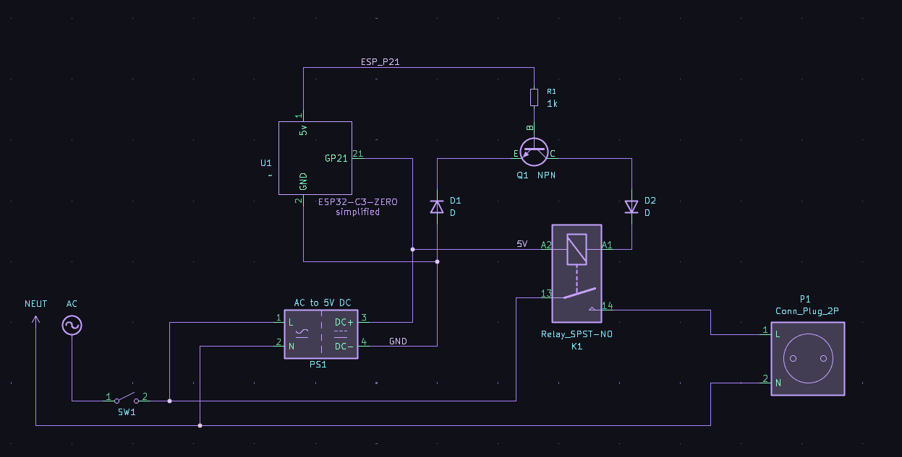

# SSPlug
A ***Simple Smart Plug***, privacy focused, fully open source and unrelient on anything. Simply plug in and use.

# How does one build this?

SSPlug is made from easily accessible and relatively cheap parts so even people who are more down on their luck than others can make and use it.
Building one requires knowledge on reading electical schematics, basic use of tools such as a soldering iron. 
A computer is also

Below is the schematic as well as the parts needed to build one.

Required parts (from left to right of the schematic):
`1x Male electrical plug
1x Kipp (or other) switch
1x The guts of a phone charger (or a similar 220/120V AC to 5V DC converter)
2x Diode
1x ESP32-C3-Zero (or similar microcontroller which can access WiFi)
1x 2N3904 NPN Transistor
1x Relay (must be 5V but the amperage depends on the user device)
1x Female plug
And some wire, and optional but higly recommended is some form of box to put all the electronics in (e.g. a waterproof kitchen container, a large junction box etc.)`

# Flashing the SSPlug 

Download the code from SSPlugSource/code, and download and install ArduinoIDE then open the code.
### Be sure to change the `ssid` and `password` variables to your SSID and password before flashing! 
Flash your microcontroller by plugging it into your computer and select it from the list, then just upload using CTRL + U or pressing the upload button.

You have now flashed your smart plug.

# Credits

Schematic made in KiCAD by [VerbenaIDK](https://verbenaidk.art/)

Switch design by [r7chardgh](https://uiverse.io/r7chardgh)

Design and code by me, Dangrain.

